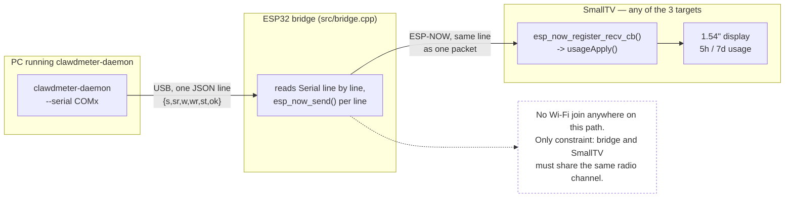

# ESP-NOW usage transport (fork-specific)

This fork adds a fourth way to get Claude usage data onto the device: instead
of the device reaching the daemon over HTTP (`push`/`serve`) or plugging
directly into it (`serial`), a small companion **bridge** board relays the
daemon's serial JSON lines wirelessly over **ESP-NOW** — a direct radio link
between two ESP chips that needs no Wi-Fi association, no router, no IP
address.

## Why

The `push`/`serve` HTTP transports need the SmallTV to join your Wi-Fi and
stay reachable on it. That's a real obstacle on some networks: 802.1X
enterprise auth that the Arduino Wi-Fi stack can't do, captive portals,
client isolation, MAC allow-listing, or an IT policy that simply won't let a
random IoT device onto the corporate LAN. `--serial` sidesteps Wi-Fi
entirely, but only works if the device is physically plugged into the same
machine as the daemon — and the ESP8266 SmallTV can't even do that, because
its USB port supplies power only; there's no USB-serial chip on the board (see
the main README's "Tell-tale" row) and the ESP8266's own UART is only reachable
on internal solder pads.

ESP-NOW solves both problems the same way: it never joins any network, so a
filtered/locked-down Wi-Fi is a non-issue, and it also gets data onto a board
with no exposed UART. It works identically on **all three** SmallTV targets
in this repo (`smalltv` / ESP8266, `smalltv_c2` / ESP32-C2, `smalltv_esp32` /
ESP32) — the ESP32 variants don't strictly *need* it since they have a real
USB-serial chip, but using ESP-NOW there too means the display can sit
anywhere in radio range without ever touching your Wi-Fi, which is the actual
point on a restrictive network.

## How it fits together



The daemon and its `--serial` transport are completely unmodified — they
already write exactly this line format over any USB-serial port, which is
all the bridge looks like to them.

## What changed vs. upstream

- **`src/features/usage/UsageClient.{h,cpp}`** — added `usageEspNowBegin()`,
  with one implementation per chip family (ESP8266's older `<espnow.h>` API
  vs. the ESP32/ESP32-C2 `<esp_now.h>` API — the callback signatures differ).
  Registers an ESP-NOW receive callback that feeds each incoming packet
  straight into the existing `usageApply()` (the same parser the HTTP push
  endpoint already uses). Called once from `usageInit()`, guarded to run only
  the first time.
- **`src/WebPortal.cpp`** — `/api/status` now also returns `mac` (the
  device's Wi-Fi MAC) and `chan` (its current Wi-Fi channel), so you can read
  the two values the bridge needs to pair without opening a serial console.
- **`src/bridge.cpp`** (new) — the bridge firmware itself, board-agnostic on
  the receiving end. Reads newline-terminated JSON lines from `Serial` and
  forwards each as one ESP-NOW packet to its paired peer. Pairing is a serial
  command (`PAIR AA:BB:CC:DD:EE:FF <chan>`, see `tools/pair_bridge.py`) saved
  to NVS — no reflash needed to point it at a different SmallTV or to follow
  a channel change. `DEFAULT_PEER_MAC`/`DEFAULT_CHANNEL` at the top of the
  file are only the first-boot fallback before anything's been paired.
- **`tools/pair_bridge.py`** (new) — sends that `PAIR` command over serial.
- **`platformio.ini`** — new `[env:espnow_bridge]` (plain ESP32 dev board,
  builds only `bridge.cpp`, same on/off pattern as the existing
  `smalltv_loader` env). Also set `WITH_TICKER=0` / `WITH_RADAR=0` on the
  `smalltv` env to free up flash headroom for the ESP8266 build — re-enable if
  you need those features too.
- **`src/Net.{h,cpp}`, `src/Gfx.{h,cpp}`, `src/config.h`** — the setup AP is
  now pinned to a fixed channel (`AP_ESPNOW_CHANNEL`) and shows its MAC/channel
  directly on-screen (`gfxApInfo`); if zero networks are saved it self-closes
  after `AP_ESPNOW_TIMEOUT_MS` and drops to an idle, ESP-NOW-only radio on the
  same channel (`netEspNowOnly()`) instead of showing the join-my-AP screen
  forever — see "Option B" below.

No changes to the usage payload contract (`{s,sr,w,wr,st,ok}`) and no changes
to `clawdmeter-daemon` itself — it already writes exactly this over
`--serial`, just pointed at the bridge's COM port instead of a device's.

## Setup

### Option A — SmallTV already on your Wi-Fi

1. Flash this firmware as usual (`pio run -e <smalltv | smalltv_c2 |
   smalltv_esp32> -t upload`, or OTA via `/update`). Once it's on your Wi-Fi,
   open `http://<its-ip>/api/status` and note `mac` and `chan`.
2. Flash the bridge onto a spare ESP32 dev board (only once — no need to
   rebuild it again to change pairing): `pio run -e espnow_bridge -t upload`.
3. Pair it: `python tools/pair_bridge.py COM3 <mac> <chan>` — saved to the
   bridge's NVS, survives reboots.
4. Plug that board into the machine running clawdmeter-daemon and run it with
   `--serial <bridge's COM port>` instead of `--push` / `--serve`.

### Option B — never joining Wi-Fi at all

For a locked-down/filtered network where you'd rather not put the SmallTV on
it at all: leave the device's Wi-Fi settings empty (factory default, or
`/api/factory` to reset them). On boot it opens its `SmallTV-Setup` AP as
always, but the setup screen now also prints its **MAC and channel directly
on the display** — no browser, no network, nothing to join:

```
ESP-NOW AA:BB:CC:DD:EE:FF ch1
```

The AP is pinned to a fixed channel (`AP_ESPNOW_CHANNEL` in `config.h`,
default **1**) instead of whatever the Arduino core would pick, so you can
hardcode the bridge's channel before ever seeing the screen if you want.

1. Read the MAC off the screen (channel is already `1` by default, matching
   `AP_ESPNOW_CHANNEL`).
2. Flash the bridge if you haven't already (`pio run -e espnow_bridge -t
   upload`), pair it (`python tools/pair_bridge.py COM3 <mac> 1`), and point
   the daemon's `--serial` at it, same as option A.
3. After `AP_ESPNOW_TIMEOUT_MS` (default **15 minutes**, in `config.h`) with
   still no Wi-Fi configured, the device closes its setup AP on its own —
   no open hotspot left running — and drops to an idle radio pinned to the
   same channel, purely receiving ESP-NOW. The active display mode (usage /
   ticker / radar) then renders normally, fed only by whatever the bridge
   sends. This only ever triggers when **zero** networks are saved; a
   still-in-progress captive-portal setup is never cut short by it.

If you want the MAC/channel again later, just factory-reset or wait for a
reboot — the setup screen (and its 15-minute window) reappears each time
there's no saved Wi-Fi.

## Monitoring and pairing the bridge

`tools/espnow_bridge_daemon.py` is a small tray-icon tool (styled after
clawdmeter-daemon) that stays connected to the bridge: it streams every line
the bridge prints (delivery ACKs, pairing confirmations) to a log file and
the tray tooltip, and its menu has **Pair device...** / **Unpair device...**
/ **Unpair all** dialogs — no reflash, no typing raw serial commands.

```
pip install pyserial pystray Pillow
python tools/espnow_bridge_daemon.py COM3
python tools/espnow_bridge_daemon.py COM3 --no-tray   # headless console instead
```

For one-off scripting rather than a standing monitor, `tools/pair_bridge.py`
(see below) sends the same PAIR/UNPAIR commands non-interactively.

## Testing without the daemon

`tools/send_test_usage.py` writes one usage-contract JSON line straight to a
serial port — point it at the bridge's COM port to check the whole
daemon → bridge → ESP-NOW → SmallTV chain without running the real daemon or
needing a valid Claude token:

```
pip install pyserial
python tools/send_test_usage.py COM3
python tools/send_test_usage.py COM3 --s 90 --w 50 --st rejected
python tools/send_test_usage.py COM3 --ok false     # simulate "no data"
```

The SmallTV's screen should update within a second (once its active mode is
Usage — the carousel will get there on its own timer, or set the mode
directly via `/api/config`). This is exactly how the initial pairing test in
this fork's history was done, before wiring up the real daemon.

## Known limitation

ESP-NOW does not hop channels. The bridge is pinned to whatever channel it
was last paired with. If your router changes channel (auto-channel, a
reboot, a firmware update), the link silently stops — re-check `/api/status`
for the new `chan` and re-pair with `tools/pair_bridge.py` (no reflash). This
hasn't been worth automating further since it's just being tested; a fix
would have the SmallTV broadcast its current channel (e.g. in its mDNS TXT
record) and the bridge read it back on its own instead of needing a manual
re-pair.
