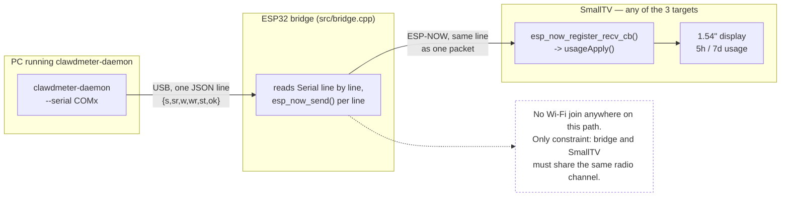

# ESP-NOW usage transport (fork-specific)

This fork adds a fourth way to get Claude usage data onto the device: instead
of the device reaching the daemon over HTTP (`push`/`serve`) or plugging
directly into it (`serial`), a small companion **bridge** board relays the
daemon's serial JSON lines wirelessly over **ESP-NOW** — a direct radio link
between two ESP chips that needs no Wi-Fi association, no router, no IP
address.

## Why

The `push`/`serve` HTTP transports need the SmallTV to join your Wi-Fi and
stay reachable on it. That's a real obstacle on some networks: 802.1X
enterprise auth that the Arduino Wi-Fi stack can't do, captive portals,
client isolation, MAC allow-listing, or an IT policy that simply won't let a
random IoT device onto the corporate LAN. `--serial` sidesteps Wi-Fi
entirely, but only works if the device is physically plugged into the same
machine as the daemon — and the ESP8266 SmallTV can't even do that, because
its USB port supplies power only; there's no USB-serial chip on the board (see
the main README's "Tell-tale" row) and the ESP8266's own UART is only reachable
on internal solder pads.

ESP-NOW solves both problems the same way: it never joins any network, so a
filtered/locked-down Wi-Fi is a non-issue, and it also gets data onto a board
with no exposed UART. It works identically on **all three** SmallTV targets
in this repo (`smalltv` / ESP8266, `smalltv_c2` / ESP32-C2, `smalltv_esp32` /
ESP32) — the ESP32 variants don't strictly *need* it since they have a real
USB-serial chip, but using ESP-NOW there too means the display can sit
anywhere in radio range without ever touching your Wi-Fi, which is the actual
point on a restrictive network.

## How it fits together

The daemon and its `--serial` transport are completely unmodified — they
already write exactly this line format over any USB-serial port, which is
all the bridge looks like to them.

## What changed vs. upstream

- **`src/features/usage/UsageClient.{h,cpp}`** — added `usageEspNowBegin()`,
  with one implementation per chip family (ESP8266's older `<espnow.h>` API
  vs. the ESP32/ESP32-C2 `<esp_now.h>` API — the callback signatures differ).
  Registers an ESP-NOW receive callback that feeds each incoming packet
  straight into the existing `usageApply()` (the same parser the HTTP push
  endpoint already uses). Called once from `usageInit()`, guarded to run only
  the first time.
- **`src/WebPortal.cpp`** — `/api/status` now also returns `mac` (the
  device's Wi-Fi MAC) and `chan` (its current Wi-Fi channel), so you can read
  the two values the bridge needs to pair without opening a serial console.
- **`src/bridge.cpp`** (new) — the bridge firmware itself, board-agnostic on
  the receiving end. Reads newline-terminated JSON lines from `Serial` and
  forwards each as one ESP-NOW packet to a hardcoded peer MAC/channel. Edit
  the `PEER_MAC` / `WIFI_CHANNEL` constants at the top of the file before
  building — see below.
- **`platformio.ini`** — new `[env:espnow_bridge]` (plain ESP32 dev board,
  builds only `bridge.cpp`, same on/off pattern as the existing
  `smalltv_loader` env). Also set `WITH_TICKER=0` / `WITH_RADAR=0` on the
  `smalltv` env to free up flash headroom for the ESP8266 build — re-enable if
  you need those features too.

No changes to the usage payload contract (`{s,sr,w,wr,st,ok}`) and no changes
to `clawdmeter-daemon` itself — it already writes exactly this over
`--serial`, just pointed at the bridge's COM port instead of a device's.

## Setup

1. Flash this firmware onto your SmallTV as usual (`pio run -e <smalltv |
   smalltv_c2 | smalltv_esp32> -t upload`, or OTA via `/update`). Once it's on
   your Wi-Fi, open `http://<its-ip>/api/status` and note `mac` and `chan`.
2. Edit `PEER_MAC` and `WIFI_CHANNEL` at the top of `src/bridge.cpp` with
   those values.
3. Flash `src/bridge.cpp` onto a spare ESP32 dev board:
   `pio run -e espnow_bridge -t upload`.
4. Plug that board into the machine running clawdmeter-daemon and run it with
   `--serial <bridge's COM port>` instead of `--push` / `--serve`.

## Known limitation

ESP-NOW does not hop channels. The bridge is pinned to whatever channel your
router had the SmallTV on *at flash time*. If your router changes channel
(auto-channel, a reboot, a firmware update), the link silently stops — re-check
`/api/status` for the new `chan` and reflash the bridge. This hasn't been
worth automating yet since it's just being tested; a fix would have the
SmallTV broadcast its current channel (e.g. in its mDNS TXT record) and the
bridge read it back instead of hardcoding it.
