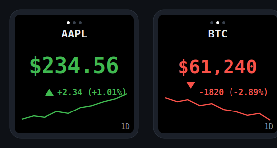

# smalltv-mod

Custom open-source firmware for the **GeekMagic SmallTV** (the cheap ESP‑12F /
ESP8266 version with a 1.54" 240×240 ST7789 display). It turns the little display
into a **stock / crypto ticker**: it shows the current price, the change and
%‑change, and a tiny sparkline chart, rotating through several symbols. All data
comes from **your own n8n webhook** (or any HTTP endpoint), and everything is
configured from a built‑in **web UI** — WiFi, what to show, the symbol list, and
**OTA firmware updates**.

> Not affiliated with GeekMagic. This replaces the stock firmware entirely.



## Features

- 📈 **Stock / crypto ticker** — price, absolute change, %‑change with up/down
  arrow, and a sparkline chart.
- 🔁 **Multiple symbols** that rotate on a configurable interval.
- 🌐 **Pull-based data** from a configurable webhook (n8n, Node‑RED, anything).
  *You* own the data source; the device just renders what it's given.
- 🛠 **Full web UI** — connect to WiFi, configure the AP/hotspot, pick what to
  show, manage the symbol list, set brightness/orientation/colours.
- ⬆️ **OTA updates** — flash new firmware from the browser, no cable needed.
- 📶 **Captive-portal setup** — first boot creates a `SmallTV-Setup` hotspot.
- 🧠 Tiny footprint: ~41 KB free heap, framebuffer-less rendering, HTTP **or**
  HTTPS.

## Hardware

| | |
|---|---|
| MCU | ESP‑12F (ESP8266, 4 MB flash) |
| Display | 1.54" 240×240 IPS, **ST7789**, SPI |
| Backlight | PWM, GPIO5 |
| Light sensor | optional LDR on `A0` (not populated on all units) |

### Pin map

These are the pins this firmware drives (confirmed from teardowns and the
ESPHome/Tasmota community — see [Credits](#credits-and-references)):

| Signal | GPIO | Note |
|--------|------|------|
| SPI CLK | 14 | hardware SPI (fixed) |
| SPI MOSI | 13 | hardware SPI (fixed) |
| DC | 0 | boot-strap pin |
| RST | 2 | boot-strap pin |
| CS | 15 | boot-strap pin |
| Backlight | 5 | PWM |

If your unit's screen stays **dark**, try enabling *“Backlight is active‑low”* in
**Display**. If colours/orientation look wrong, change **Orientation** or the
colour scheme. The pins themselves are not configurable from the UI (they're
fixed to the SmallTV wiring); change them in [`src/config.h`](src/config.h) if you
have a different board.

## Get the firmware

You don't need a toolchain — **GitHub Actions builds `firmware.bin` for you**:

- Every push: **Actions** tab → latest `build` run → download the
  `smalltv-mod-firmware` artifact.
- Tagged releases (`vX.Y.Z`): attached to the [Releases](../../releases) page.

Or [build it yourself](#building-from-source).

## Flashing

### Method A — over the air, from the stock web UI (recommended, no soldering)

The stock GeekMagic firmware exposes an OTA updater at `/update` that accepts any
valid ESP8266 image. So you can install this firmware **without opening the
device**:

1. Find the device's IP (it's shown on screen / in the stock Settings app).
2. Browse to `http://<device-ip>/update`.
3. Upload `smalltv-mod-firmware.bin`. It reboots into this firmware.

> ⚠️ **Back up the stock firmware first if you want to be able to go back** — the
> stock `.bin` is not redistributed here. See [recovery](#recovery--going-back).
> Flashing custom firmware is at your own risk.

### Method B — UART header (fallback / recovery)

If OTA isn't available or you bricked it, flash over the serial header. You need a
3.3 V USB‑UART adapter. Pull **GPIO0 to GND** while powering on to enter flash
mode, then:

```bash
# back up the original firmware first (4 MB)
esptool.py --port COM5 read_flash 0x0 0x400000 stock-backup.bin

# write this firmware
esptool.py --port COM5 write_flash 0x0 smalltv-mod-firmware.bin
```

Or with PlatformIO (wiring connected): `pio run -t upload`.

## First-time setup

1. On first boot (no WiFi saved) the device shows **SETUP MODE** and creates an
   open WiFi hotspot **`SmallTV-Setup`**.
2. Join it with your phone/PC. A captive portal should pop up; if not, open
   **http://192.168.4.1**.
3. Go to the **WiFi** tab → **Scan** → pick your 2.4 GHz network → enter the
   password → **Save & connect**. The device reboots and joins your network.
4. Its new IP is shown on screen. Browse to it (or `http://smalltv.local`).
5. Go to **Display → Webhook URL**, paste your n8n webhook, and add tickers under
   **Symbols**.

## Web UI

| Tab | What you can do |
|-----|-----------------|
| **Status** | Live device info (mode, IP, signal, heap, uptime) and current ticker values. “Refresh data now” forces a poll. |
| **WiFi** | Scan & join a network; configure the AP name/password and the mDNS hostname. |
| **Display** | Brightness (+ optional auto‑brightness), orientation, backlight polarity, colour scheme, rotation/refresh intervals, webhook URL, chart timeframe & points, and **what to show** (name, price, change, chart, timeframe label, “updated N s ago”, rotation dots). |
| **Symbols** | Up to **8** tickers. `symbol` is sent to your webhook (e.g. `AAPL`, `BTC-USD`, `EURUSD=X`); `name` is an optional friendly label. |
| **Update** | OTA firmware upload, reboot, factory reset. |

“**Save settings**” applies most changes live. Changing the WiFi network reboots
the device.

## Data source / webhook

The device periodically calls your webhook, **one request per symbol**:

```
GET  <webhookUrl>?symbol=AAPL&range=1d&points=48
```

and expects a small JSON object back:

```json
{
  "symbol": "AAPL",
  "name": "Apple",
  "price": 234.56,
  "currency": "$",
  "change": 2.34,
  "changePct": 1.01,
  "spark": [230.1, 231.0, 229.8, 234.56],
  "range": "1D",
  "ok": true
}
```

Only `price` is required. Full contract, field table, and a **ready-to-import
n8n workflow** (sourcing from Yahoo Finance) are in **[`n8n/`](n8n/README.md)**.

Why pull instead of push? The device fetches on its own schedule, so n8n never
needs to know the device's IP, and it keeps working if the IP changes.

## Building from source

Requires [PlatformIO](https://platformio.org/):

```bash
pio run                      # build  ->  .pio/build/smalltv/firmware.bin
pio run -t upload            # build + flash over UART
pio device monitor           # serial logs @ 115200
```

Project layout:

```
src/
  main.cpp          orchestration: setup/loop, rotation, render scheduling
  config.h          pins, limits, compile-time defaults, firmware version
  Settings.*        config struct + LittleFS persistence (config.json)
  Net.*             WiFi STA / fallback AP / captive portal / mDNS
  WebPortal.*       web server, REST API, OTA endpoint
  webui.h           the single-page UI (HTML/CSS/JS, served from PROGMEM)
  Display.*         ST7789 rendering (Arduino_GFX), sparkline, status screens
  StockClient.*     webhook fetch (HTTP/HTTPS) + JSON parse + poll timing
  StockData.h       per-ticker runtime struct
n8n/                webhook contract + importable workflow
```

Footprint: ~527 KB flash (of 1 MB) and ~50 % RAM at boot — plenty of headroom for
OTA (which needs room for two sketch copies).

## Recovery / going back

- **Re-flash** anything (stock backup or this firmware) over the UART header
  (Method B). Keep a `stock-backup.bin` if you might want the original apps back.
- **Factory reset** (Update tab) wipes saved settings and restarts in SETUP MODE
  — it does *not* change the firmware.

## Notes & limitations

- 2.4 GHz WiFi only (ESP8266). WPA2; for an AP password use ≥ 8 chars or leave it
  blank for an open hotspot.
- The web server is single-threaded; during a data poll the UI may pause briefly.
- HTTPS works but is RAM-tight on the ESP8266 — prefer plain HTTP on your LAN for
  the webhook if you see instability (see the [n8n notes](n8n/README.md)).
- Fonts are the built-in bitmap font (scaled), chosen for reliability and the
  retro look — no external font files needed.

## Credits and references

- GeekMagic SmallTV / SmallTV‑Pro — original product & stock firmware
  ([GeekMagicClock/smalltv-pro](https://github.com/GeekMagicClock/smalltv-pro)).
- Pin mapping & hardware notes from the ESPHome / Tasmota communities:
  - [ViToni/esphome-geekmagic-smalltv](https://github.com/ViToni/esphome-geekmagic-smalltv)
  - [Times-Z/GeekMagic-Open-Firmware](https://github.com/Times-Z/GeekMagic-Open-Firmware)
  - [Installing ESPHome on GEEKMAGIC SmallTV (HA community)](https://community.home-assistant.io/t/installing-esphome-on-geekmagic-smart-weather-clock-smalltv-pro/618029)
  - [Puddle of Code — My Own GeekMagic SmallTV](https://puddleofcode.com/story/my-own-geekmagic-smalltv/)
- Libraries: [Arduino_GFX](https://github.com/moononournation/Arduino_GFX),
  [ArduinoJson](https://arduinojson.org/).

## License

[WTFPL](LICENSE) — Do What The F*ck You Want To Public License.
